# Inventory Management System - Flowchart

## 🎯 System Architecture Flowchart

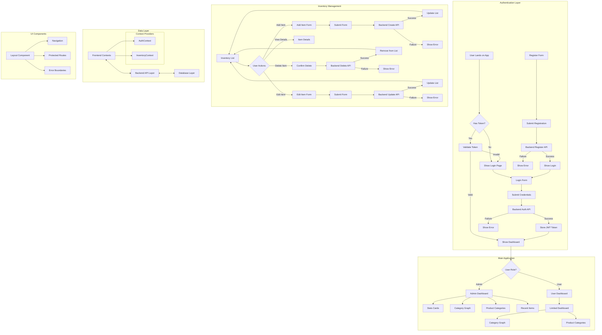

## 🔄 User Journey Flow

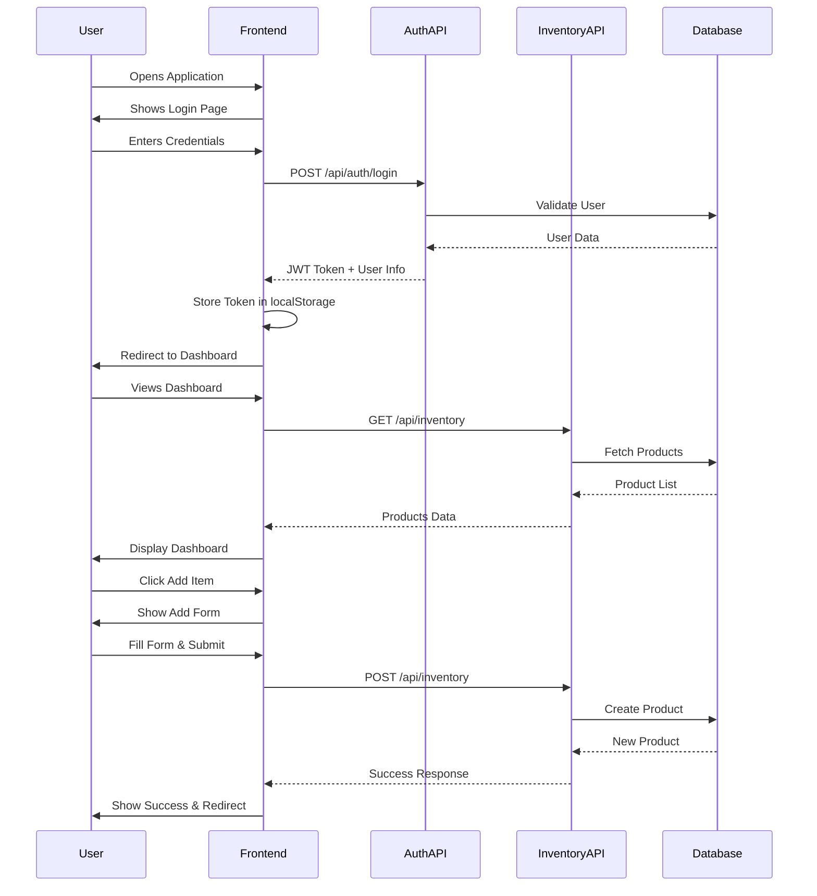

## 📊 Component Hierarchy

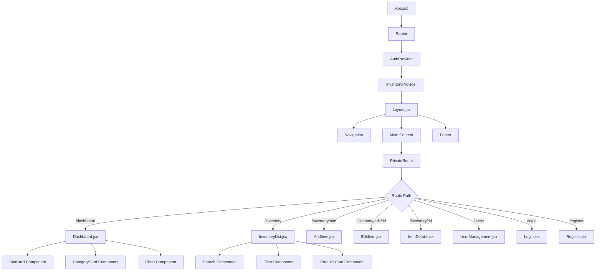

## 🗄️ Database Schema Flow

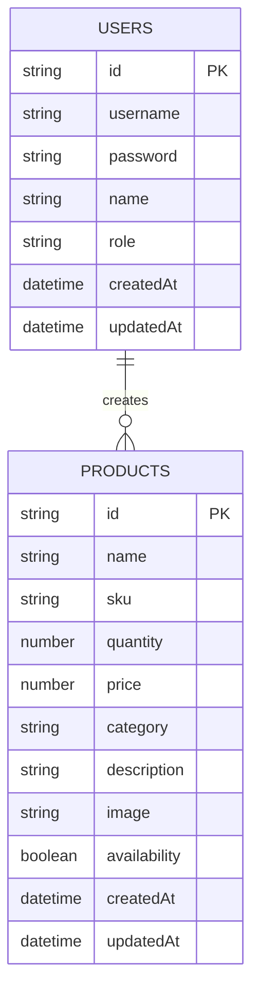

## 🔐 Authentication Flow

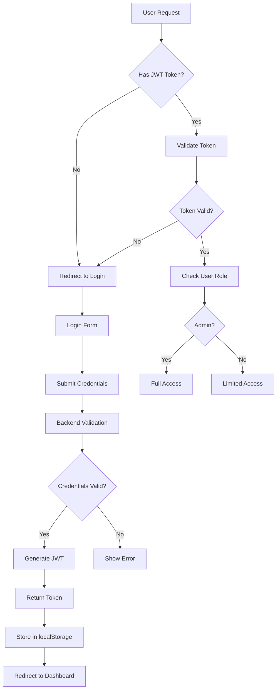

## 📦 Inventory CRUD Flow

```mermaid
flowchart LR
    subgraph "Create Flow"
        A1[Add Item Form] --> A2[Form Validation]
        A2 --> A3{Valid?}
        A3 -->|No| A4[Show Errors]
        A3 -->|Yes| A5[API Call]
        A5 --> A6{API Success?}
        A6 -->|No| A7[Show Error]
        A6 -->|Yes| A8[Update State]
        A8 --> A9[Redirect to List]
    end
    
    subgraph "Read Flow"
        B1[Load Inventory] --> B2[API Call]
        B2 --> B3{API Success?}
        B3 -->|No| B4[Show Error]
        B3 -->|Yes| B5[Update State]
        B5 --> B6[Display Items]
    end
    
    subgraph "Update Flow"
        C1[Edit Item Form] --> C2[Load Current Data]
        C2 --> C3[Form Validation]
        C3 --> C4{Valid?}
        C4 -->|No| C5[Show Errors]
        C4 -->|Yes| C6[API Call]
        C6 --> C7{API Success?}
        C7 -->|No| C8[Show Error]
        C7 -->|Yes| C9[Update State]
        C9 --> C10[Redirect to List]
    end
    
    subgraph "Delete Flow"
        D1[Delete Button] --> D2[Confirmation Dialog]
        D2 --> D3{Confirmed?}
        D3 -->|No| D4[Cancel]
        D3 -->|Yes| D5[API Call]
        D5 --> D6{API Success?}
        D6 -->|No| D7[Show Error]
        D6 -->|Yes| D8[Update State]
        D8 --> D9[Remove from List]
    end
```

## 🎨 UI Component Flow

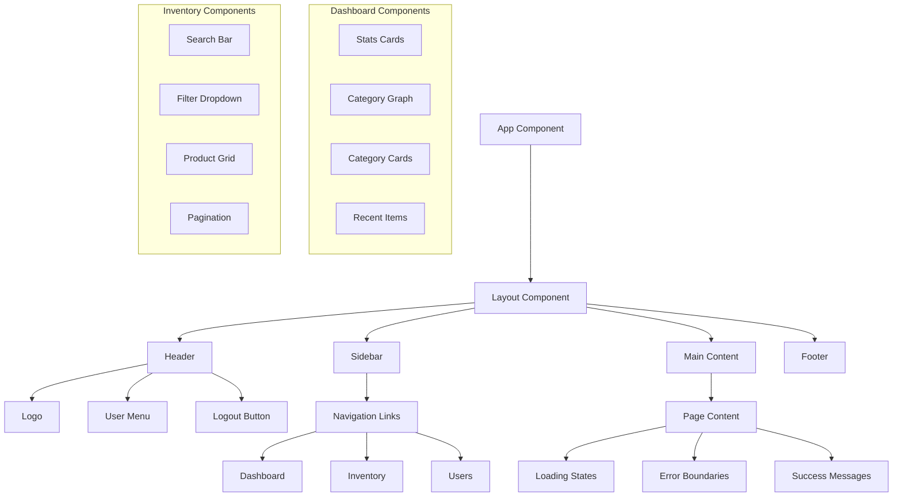

## 🔄 State Management Flow

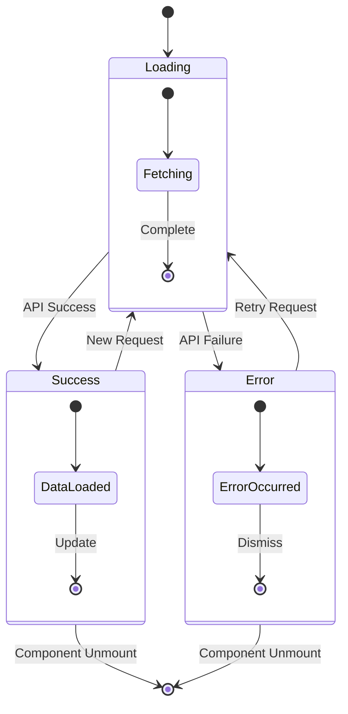

## 🚀 Deployment Flow

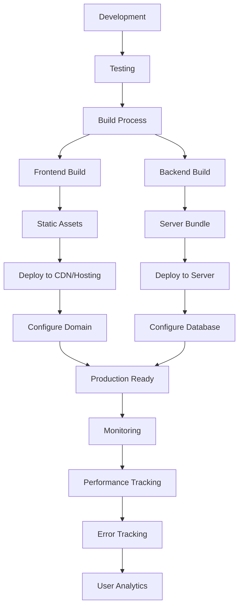

## 📱 Mobile Responsive Flow

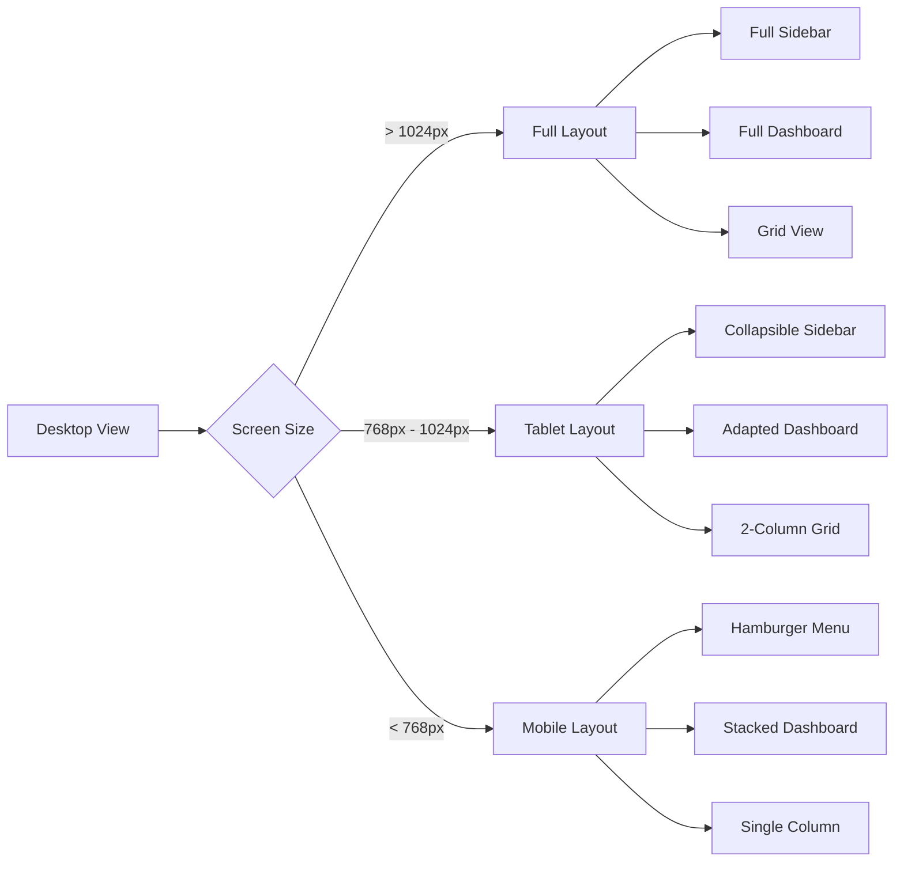

## 🔍 Search and Filter Flow

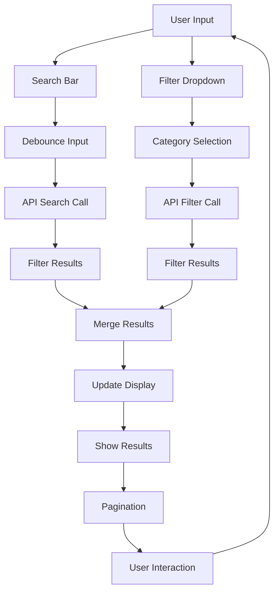

## 📊 Analytics and Reporting Flow

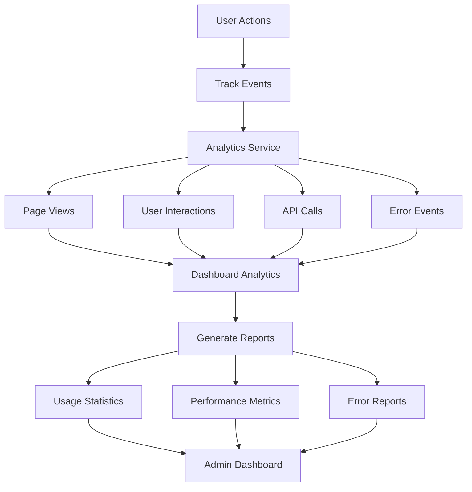

---

## 🎯 Key Flow Points

### **Authentication Flow:**
1. **User enters credentials** → Backend validation
2. **JWT token generated** → Stored in localStorage
3. **Token validation** → On every request
4. **Role-based access** → Admin vs User permissions

### **Data Flow:**
1. **Frontend Context** → Manages global state
2. **API Layer** → Handles HTTP requests
3. **Database** → Persistent data storage
4. **Real-time updates** → State synchronization

### **Component Flow:**
1. **App.jsx** → Root component with routing
2. **Layout.jsx** → Main app structure
3. **Pages** → Route-based components
4. **Components** → Reusable UI elements

### **CRUD Operations:**
1. **Create** → Form validation → API call → State update
2. **Read** → API call → Data loading → Display
3. **Update** → Load data → Form validation → API call → State update
4. **Delete** → Confirmation → API call → State update

This flowchart provides a complete visual representation of your Inventory Management System architecture and data flow! 🚀
